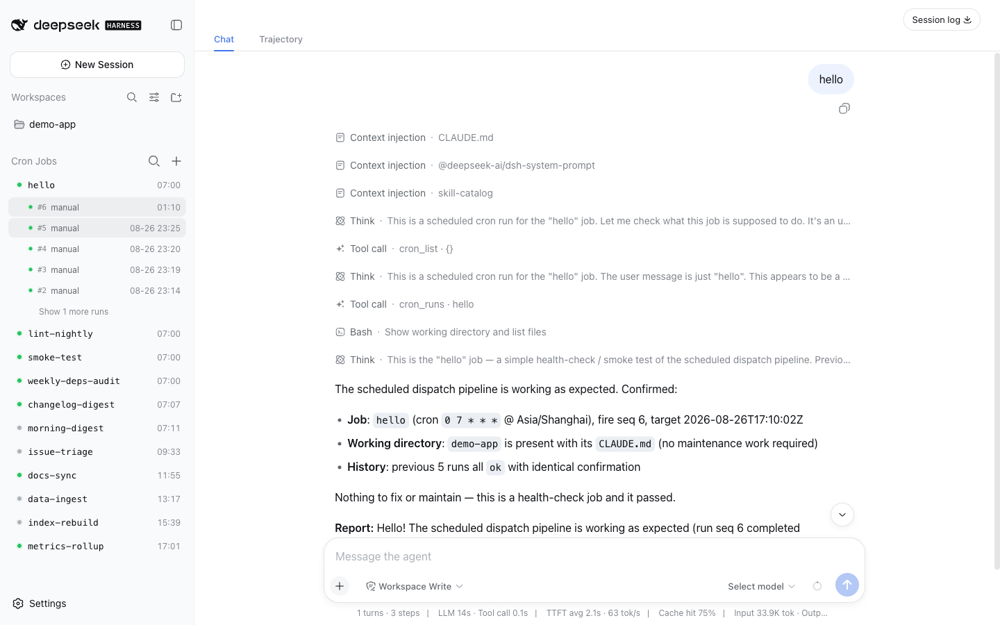
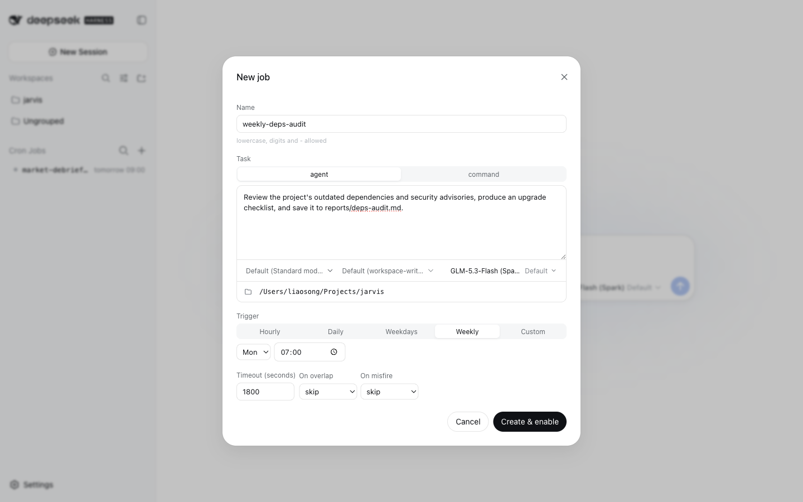
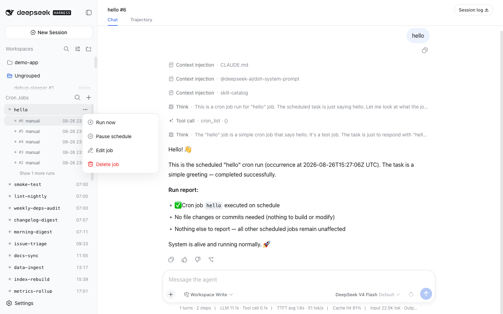

# dsh-cron

[English](README.md) | 简体中文

DeepSeek Harness (dsh) 的无人值守定时任务插件：按 cron 表达式 / 固定周期 / 一次性时刻，定时跑 **agent 任务**（新建一次性 agent 执行 prompt，走完整 dsh 工具链）或 **command 任务**（直接跑脚本）。与 `@deepseek-ai/dsh-schedule` 互补——那是会话内的持久提醒，这是 host 面的作业调度器：作业不属于任何交互会话，进程常驻期间自动执行。



## 界面

- **侧栏平级 section**：状态点（上次结果）+ 下次触发时间，运行中实时计时；行内展开运行历史，agent 运行点击直接跳到该次运行的完整会话，command 运行点击在中央区域打开运行详情页（状态、耗时、退出码、命令与输出尾部）。
- **新建 / 编辑弹窗**：触发预设（每小时 / 每天 / 工作日 / 每周，自定义档收纳 cron 表达式 / 周期 / 一次性）、任务类型、模式 / 权限 / 模型（留空继承默认）、工作目录、超时与重叠 / 错过策略，一屏配完；时区自动取浏览器当前时区，编辑时沿用作业原时区。

| 新建作业 | 行内操作菜单 |
| --- | --- |
|  |  |

## 能力

- **三种触发**：`cron`（5 字段表达式 + 显式 IANA `timeZone`，绝不读进程时区）、`everySeconds`（锚点对齐周期，最短 60s）、`at`（RFC 3339 一次性时刻，必须带 Z/偏移量）。
- **三种声明方式**：profile config（声明式，随 profile 一起版本化）、运行时面板（侧栏 `+`，或会话里 `cron_create`——落成「manual」作业）、以及别的插件经 `cron` 服务注册（`ctx.cron.registerJob`，见[插件模式添加作业](#插件模式添加作业)）。
- **两种任务**：`agent`（`ctx.agents.create` 新建一次性 agent，提交 prompt，等 quiescence，取最后一条 assistant 文本作 summary，dispose 收尾——即 dsh-headless 的 one-shot 配方）；`command`（spawn 子进程，记录 exit code 与输出尾部）。
- **持久状态**：作业 dispatch 状态与运行历史存 storage domain 层（`ctx.storage.domain`，domain 名 `cron`），不进会话事件日志。
- **可靠性语义**：每个发生点 at-most-once（先落盘 `lastFiredMs` 再执行）；错过的发生点绝不逐个补跑（misfire 策略最多补一次、取最新一个到期点）；宕机中断的运行在下次启动时修复为 `aborted`。
- **策略**：`overlap: skip | queue | replace`（上一轮未跑完时跳过 / 排队最新一个 / 掐掉重来）；`misfire: skip | runOnce`（停机期间错过的发生点忽略 / 补跑一次）。
- **交付**：可选 delivery 命令，运行记录以 JSON 从 stdin 喂入（默认仅失败时触发）。
- **时钟纪律**（承自 dsh-schedule）：长等待拆段、每次唤醒重读墙钟——回拨不会提前触发，前跳按 overdue 处理。

## 安装

### 插件市场安装

装有 [dsh-market](https://github.com/dsh-market/dsh-market) 时，打开 **设置 → 插件市场**，搜索 **dsh-cron** 一键安装——市场会同时写好依赖与 profile 的 bundle 声明，多数情况下刷新页面即生效。

也可以用命令行直接装 release tarball（这只完成包安装，`dsh.profile.bundles` 里的 `"dsh-cron"` 需按下文自行补上）：

```sh
dsh plugin --profile web add https://github.com/squirrel20/dsh-cron/releases/latest/download/dsh-cron.tgz
```

> npm 上名为 `dsh-cron` 的包是另一个无关项目——请从插件市场或 release tarball 安装，不要走 npm registry。

### 源码安装

profile 的 `package.json`：

```jsonc
{
  "dependencies": { "dsh-cron": "link:/path/to/dsh-cron" },   // 或 git checkout / release tarball
  "dsh": { "profile": { "bundles": [ /* …既有 bundles… */, "dsh-cron" ] } }
}
```

### config 声明作业（可选）

需要「常驻声明式」作业时，在 profile 的 `cordis.patch.yml` 里覆盖 config；也可以完全跳过这步，改用界面或会话内创建（见[使用](#使用)）：

```yaml
- id: dsh-cron
  config:
    historyLimit: 50
    jobs:
      - name: daily-log-review
        schedule: { cron: "0 7 * * *", timeZone: "Asia/Shanghai" }
        task:
          kind: agent
          prompt: 读取 logs/ 下昨日日志，总结异常并给出处置建议。
          cwd: /path/to/project
          timeoutSeconds: 1800
        policy: { overlap: skip, misfire: skip }
        delivery:
          argv: ["/usr/local/bin/notify", "--stdin"]
          onlyOnFailure: true
      - name: heartbeat
        schedule: { everySeconds: 3600 }
        task: { kind: command, argv: ["./scripts/heartbeat.sh"], cwd: /path/to/project }
```

作业配置错误（重名、非法表达式、缺时区等）在挂载期 fail loud，不会静默吞掉。

同层还有一个可选的 `maxConcurrentRuns`：**默认 `0` = 不限并发**，互不相干的作业没理由互相排队（作业自身的重叠另由 `policy.overlap` 管）。只有当你确实要给宿主压上一个全局上限时才设正数——设 `1` 意味着全部作业串行，撞点的那批会依次等前一个跑完。

## 使用

### 手工添加作业

点侧栏 **Cron Jobs** section 标题上的 **`+`**，新建作业弹窗一屏配完：

- **名称**——任意语种字母（含中文）、数字与 `-`、`_`；不含空格。
- **触发**——`cron`（5 字段表达式 + IANA 时区）、`interval` 周期、`one-shot` 一次性。
- **任务**——`agent`（prompt 无人值守走完整 dsh 工具链）或 `command`（spawn 一条 argv）。
- **Preset / 权限 / 模型**——留空继承宿主默认。
- **工作目录**——手输路径或点文件夹图标浏览选择。
- **超时、重叠策略、错过策略**——语义见[能力](#能力)。

**Create & enable** 落盘保存（「manual」标记与 config 声明的作业区分）。之后每行的 `⋯` 菜单提供 **立即运行 / 暂停调度 / 编辑 / 删除**；点行展开运行历史，点某次 agent 运行直接打开该次运行的完整会话回放，点某次 command 运行（或会话已被清理的 agent 运行）在中央区域打开该次运行的详情页。

### 会话内添加作业

在任意会话里直接对 agent 说需求即可：

> 每周一早上 7 点检查过期依赖，把升级清单存到 reports/deps-audit.md。

配套的 **cron-create** skill（宿主有 skill 注册表时自动注册）引导模型走 收集 → 确认 → 创建 → 验证 全流程，底层调用 `cron_create` 工具；`cron_delete` 同样可在会话中删除手动作业。会话里建出的作业就是普通 manual 作业——与网页弹窗写的是同一张表——立即出现在侧栏，之后也能在界面里编辑。读取/拨动类工具（`cron_list`、`cron_runs`、`cron_run_now`、`cron_enable`、`cron_disable`）对 config 声明的作业同样有效。

### 插件模式添加作业

调度节奏常常属于某个软件包，而不属于某台宿主：带刷新脚本的那个包，本来就知道它该多久跑一次。这类包可以自己注册作业——装上即有、卸载即撤，不必在每台机器的弹窗里把 spec 手抄一遍。

提供方 inject `cron` 服务、在 effect 里注册，与 `dsh-ingest` 的源插件同一套写法：

```js
export const name = "cron-source-kb";
export const inject = ["cron"];

export function apply(ctx, config) {
  ctx.effect(() => ctx.cron.registerJobs([
    {
      name: "kb-refresh",
      description: "重建知识库索引",
      schedule: { cron: "30 7 * * *", timeZone: "Asia/Shanghai" },
      task: { kind: "command", argv: ["/bin/sh", `${config.repoRoot}/scripts/kb-refresh.sh`] },
      policy: { overlap: "skip", misfire: "runOnce" },
    },
  ], { owner: "dsh-cron-source-kb" }), "kb.cron()");
}
```

- spec 与 config、`cron_create` 是同一套词汇，且**同步校验**：schedule 写错当场在提供方自己的 `apply` 里抛错，并指名是哪个字段。
- `owner` 必填——面板要据此告诉用户这个作业是谁带来的。
- `registerJob` 返回撤销函数（`registerJobs` 返回整批的那一个；批内任一条有缺陷就整批回滚，提供方不会只挂上一半的作业）。
- 注册可以早于 dsh-cron 自己启动：调度器就绪后自动接上；dsh-cron 重载时整张表重放。
- 名字必须没被占：profile config 里已声明的名字、或已被别的提供方注册的名字，一律抛错，而不是让挂载顺序决定谁赢。

插件作业在列表里就是普通作业——同样的运行历史、立即运行、暂停、会话跳转——但在面板与 `cron_create` / `cron_delete` 面前是**只读**的：要改就改提供方，要删就卸载它（`updateJob` / `cron_delete` 回 `plugin_job`）。暂停是唯一例外：启停覆盖属于用户，重新注册也不会被冲掉。

上面这个提供方的可运行副本在 [`examples/dsh-cron-source-demo`](examples/dsh-cron-source-demo)：把它加进 profile 的 `dependencies` 与 `dsh.profile.bundles`，就能看到一条插件作业出现在列表里。

卸载提供方只是停止调度，作业的调度状态与整段运行历史都留着——重新装回来是接着原来那个作业跑，而不是让一个同名的陌生人从头开始。留下的那行在面板上显示为**孤儿**（标「插件已卸载」、排在最后、没有下次触发），菜单里只剩**删除作业**，删掉才是真正清掉这段历史。

## 运行记录

`runs` 表按 `<job>#<seq>` 存最近 `historyLimit` 条：

```jsonc
{
  "job": "daily-log-review", "seq": 42,
  "target": "2026-08-26T23:00:00.000Z",       // 该发生点
  "startedAt": "…", "finishedAt": "…",
  "status": "ok",                              // ok|failed|timeout|skipped-overlap|replaced|aborted
  "summary": "…",                              // agent 最后回复 / 命令输出尾部（截断）
  "sessionId": "cron-daily-log-review-…"       // agent 任务的会话，可在 ~/.dsh/sessions 复查
}
```

## 边界与已知限制

- agent 运行带固定 `[CRON RUN]` framing，明示无人值守、禁止提问。framing 以 scoped system-prompt section 注入，用户消息只保留作业本身的 prompt；宿主缺少 system-prompt 服务时回退为拼进消息。
- config 作业只来自插件 config（声明式）；对话式工具（`cron_list` / `cron_runs` / `cron_run_now` / `cron_enable` / `cron_disable`）只观察与拨动它们，不创建或删除。运行时「manual」作业是例外：`cron_create` / `cron_delete` 可在会话中创建与删除，配套的 `cron-create` skill（host 存在 skill 注册表时自动注册）指导模型走完整流程，底层与网页创建对话框共用同一 `manual` 表。
- 插件注册的作业（`source: "plugin"`）归它的提供方包所有：可运行、可暂停、可查看，但面板与会话都改不了、删不掉——改就改提供方，删就卸载它。卸载后留下的孤儿行托着这段运行历史，由用户决定何时删掉。
- `queue` 深度为 1：只保留最新一个被挤压的发生点。

## Web overlay

profile 含 `@deepseek-ai/dsh-web-app` 时，插件同时提供一个侧栏 overlay：侧栏底部
的时钟徽标展开面板，列出全部作业（类别、调度、下次发生点、最近一次结果）；点作业
行下钻其运行历史，command 运行（及会话已被清理的 agent 运行）点击后在中央区域打开
详情页，展示状态、计划触发 / 起止时刻、耗时、exit code、命令与 summary 尾部。行上悬停出
两枚操作——未运行的行「立即运行」（同 `cron_run_now` 语义），运行中的行「停止」
（该轮记录落 `killed`，后续排程不受影响）。面板 `+` 打开建单表单（名称、触发预设
——每小时/每天/工作日/每周，编译成普通 cron 形态并在编辑时反推回档位，cron 表达式/
周期/一次性收在自定义档，时区静默取浏览器当前时区——agent/command 任务、工作目录
支持经宿主 browse 能力的目录弹窗选择、超时、overlap/misfire 策略）；建出的作业持久化在 storage domain 的 `manual` 表，
每次启动重新归一化，与 config 声明的作业并列显示并带「手动」标记——同名 config
作业获胜并逐出手动副本。手动作业的下钻视图带两击删除（垃圾桶→确认），连同其
整个运行台账一并删除；config 作业与有运行在途的作业会被拒绝。

浏览器半侧是 `lib/client.js`（经 `exports["./client"]` 与 `dsh.client` 包字段
声明）。宿主半侧（`lib/web.js`）提供 `GET /dsh-cron/api/state` 与四条写路由——
`POST …/run-now`、`…/stop`、`…/jobs`、`…/delete`——写路由强制 `application/json` 请求体，
跨站简单请求在分发前即被拒；路由仅在 `ctx.webServer` 存在时注册，headless
profile 照常挂载。

## 测试

```sh
npm test   # 调度数学（cron 解析、时区、锚点对齐、misfire 折叠）的单元测试
```
